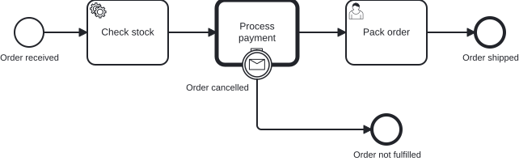
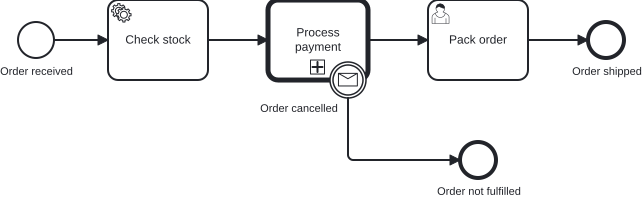

# `@miragon/rules/boundary-event-marker-overlap`

> This rule is a non-blocking `warn` in both `plugin:@miragon/rules/recommended-for-modeling` and `plugin:@miragon/rules/recommended-for-automation`. In `plugin:@miragon/rules/all` it is an `error`. Override it to `warn`, `error` or `off` yourself.

Reports a boundary event drawn over a marker or icon of its host activity.

## Why

The markers on an activity carry meaning a reader relies on: the `+` says a call activity or
collapsed sub-process has a whole process behind it, the loop and multi-instance markers say the
activity repeats, and the task type icon says who or what does the work. A boundary event is 36 px
wide and sits half inside its host, so one placed at the bottom centre hides the marker row
completely. The stakeholder reviewing the diagram then reads a call activity as a plain step and
never drills into the process behind it.

## Why this matters for agentic BPMN

Agents and auto-layout place a boundary event by computing a point on the host's border, and the
bottom centre is the obvious default. The semantic model is correct either way, so the XML review
shows nothing; the hidden marker appears only once the diagram is rendered.

**Typical AI artifact without this rule:** a message boundary event centred on the bottom edge of a
call activity, covering the `+` marker so the activity looks like an ordinary task.

**What this rule guarantees:** every marker and task type icon an activity renders stays visible
next to its boundary events.

## Scope

Only the **DI coordinates** decide, scoped per `BPMNPlane`. The rule compares the boundary event's
circle with the zones where bpmn-js draws a decoration on the host:

- **The marker row at the bottom centre**: the `+` of a call activity or collapsed sub-process, the
  loop and multi-instance markers of any activity with loop characteristics, and the ad-hoc marker.
  The zone widens when several markers stand side by side.
- **The task type icon at the top left** of a service, user, send, receive, manual, business rule
  or script task.

It does not report:

- A boundary event on a host that renders nothing at that spot, such as the bottom centre of a
  plain task or of an expanded sub-process without markers.
- A boundary event that only grazes a zone by less than 3 px.
- A boundary event whose host has no shape on the same plane.

The compensation marker is left out, because a compensation activity cannot carry a boundary
event. Overlap with the host's text label is left to visual review, since the drawn text extent is
not part of the DI.

## Examples

An order fulfillment where a cancellation message interrupts the payment call activity. The two pictures share
the same model; only the position of the boundary event differs.

👎 Invalid: `event_orderCancelled` sits on the bottom centre of the call activity and hides its `+` marker



👍 Valid: the same boundary event moved 30 px to the right, with the `+` marker visible



The same, as XML. 👎 wrong:

```xml
<bpmndi:BPMNShape id="callActivity_processPayment_di" bpmnElement="callActivity_processPayment">
  <dc:Bounds x="410" y="160" width="100" height="80" />
</bpmndi:BPMNShape>
<bpmndi:BPMNShape id="event_orderCancelled_di" bpmnElement="event_orderCancelled">
  <dc:Bounds x="442" y="222" width="36" height="36" />
</bpmndi:BPMNShape>
```

👍 right:

```xml
<bpmndi:BPMNShape id="event_orderCancelled_di" bpmnElement="event_orderCancelled">
  <dc:Bounds x="472" y="222" width="36" height="36" />
</bpmndi:BPMNShape>
```

## Further reading

- [Camunda: Creating readable process models](https://docs.camunda.io/docs/components/best-practices/modeling/creating-readable-process-models/): the readability guidance a hidden marker works against.
