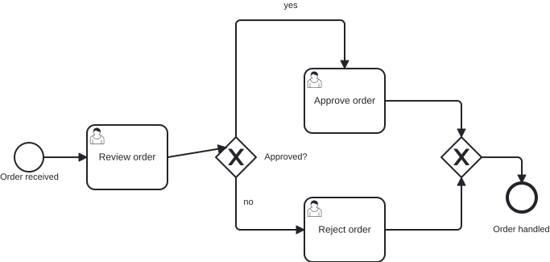
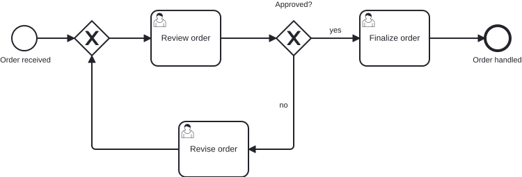

# `@miragon/rules/flow-connection-side`

> This rule is a non-blocking `warn` in both `plugin:@miragon/rules/recommended-for-modeling` and `plugin:@miragon/rules/recommended-for-automation`. In `plugin:@miragon/rules/all` it is an `error`. Override it to `warn`, `error` or `off` yourself.

Reports a sequence flow that docks onto a shape at the **wrong side**: an event entered from the
top, an activity exited to the left, or a gateway connected on a diagonal flank instead of one of
its four tips.

## Why

A BPMN diagram is the shared picture a modeler, a reviewer and a business stakeholder read to follow
the process, and it reads cleanly only when it flows left to right: the main path enters a shape on
the left and leaves on the right, and gateways branch through the tips of their diamond. When a flow
attaches somewhere else the reader has to stop and trace where each arrow actually lands to see the
path, even though the semantics (source, target) are perfectly valid.

## Why this matters for agentic BPMN

Agents and auto-layout write DI coordinates directly. They get the connection _right_ semantically
but dock the edge wherever the maths lands: into the top of a task, out of the left of a gateway,
onto the slanted flank of a diamond. The XML review looks clean; only the drawn diagram shows the
mess, and a reader (or a downstream layout pass) can no longer tell the main path from a branch.

**Typical AI artifact without this rule:** a flow that enters an activity from above or a gateway on
its diagonal edge: semantically fine, visually unreadable.

**What this rule guarantees:** every sequence flow attaches at a side that matches the element and
the flow direction, so the rendered model reads as a left-to-right process.

## Scope

Only the **DI coordinates** decide: for each sequence flow, the first waypoint is its exit off the
source, the last waypoint its entry into the target. The docking side is compared against a fixed
per-direction, per-type policy:

| Element      | Incoming (target) | Outgoing (source)                       |
| ------------ | ----------------- | --------------------------------------- |
| **Event**    | left              | top, right or bottom (any but left)     |
| **Activity** | left              | right                                   |
| **Gateway**  | any of its 4 tips | top, right or bottom (any tip but left) |

The main flow always enters on the left. An activity exits to the right; an **event** may branch its
outgoing flow out any side except the incoming-left one, the same freedom a gateway has. A gateway
is a diamond, so its only clean anchors are the four tips (the midpoints of its bounding box); a
point on a diagonal flank is reported as a diagonal connection.

### Return flows

A **return flow** is a loop-back edge whose target is drawn clearly left of its source — decided from
the two shapes' horizontal centres, with a small tolerance so a near-vertical loop (target in
roughly the same column as its source) is **not** treated as a return flow and keeps the strict
left-to-right policy above.

A return flow reads right-to-left, so its docking is judged against a mirrored form of the policy
(`left` and `right` swapped, `top`/`bottom` unchanged). Which end is mirrored depends on the
element's **role in the return path**, so each of the three endpoints below is decided
independently:

| Element      | Target — entered _(mirrored)_ | Source, **initiator** — exits _(forward)_ | Source, **chain member** — exits _(mirrored)_ |
| ------------ | ----------------------------- | ----------------------------------------- | --------------------------------------------- |
| **Event**    | right                         | top, right or bottom                      | top, left or bottom                           |
| **Activity** | right                         | right                                     | left                                          |
| **Gateway**  | any of its 4 tips             | top, right or bottom tip                  | top, left or bottom tip                       |

- **Target (entered).** Always mirrored — an activity is re-entered from the right, an event from the
  right, a gateway at any tip. A return flow that wraps into the wrong face (e.g. enters an activity
  from the left, its forward-input side) is still reported.
- **Source that _initiates_ the loop-back** — a forward-lane element that is **not** itself the
  target of a return flow. It exits on its normal **forward** side and wraps around (an activity to
  the right; an event or gateway to top/right/bottom). A short direct return that leaves an activity
  to the left is reported: it should exit right and wrap.
- **Source that is a _chain member_** — an element that **is** already the target of a return flow,
  so it sits inside the return lane. It exits on the **mirrored** side (an activity to the left; an
  event or gateway to top/left/bottom), continuing the leftward chain.

The role is read from the graph, not guessed from coordinates: an element counts as a chain member
exactly when some other return flow targets it.

### Stub length

On top of the side, a flow must leave (and enter) with a **stub**: its first segment has to run at
least `minStubLength` px straight out of the docked side before it turns. Otherwise an edge can dock
on the correct side and immediately bend away — which renders as an arrow leaving a corner with no
visible direction. The stub is measured along the docked side's **outward normal** (`right → +x`,
`left → −x`, `top → −y`, `bottom → +y`), so it is the same check for an activity edge, an event edge
and a gateway tip; boundary events are left alone here too. `minStubLength` defaults to **20**; set
it to `0` to switch the stub check off. The side is judged first — a wrong-side connection is
reported as such, not as a short stub.

Comparison is scoped per `BPMNPlane`. Left alone: shapes with no category (pools, lanes, data
objects), **boundary events** (they sit on their host's border, so a flow leaving one may dock at any
side), and any docking point too ambiguous to classify (exactly on a corner). These are never
guessed, to avoid false positives.

## Configuration

```jsonc
"@miragon/rules/flow-connection-side": ["error", { "allowBackwardsFlow": false, "minStubLength": 20 }]
```

| Option               | Default | Effect                                                                                                                                                                                              |
| -------------------- | ------- | --------------------------------------------------------------------------------------------------------------------------------------------------------------------------------------------------- |
| `allowBackwardsFlow` | `true`  | Apply the return-flow policy (see above). Set to `false` to hold **every** flow to the strict left-to-right policy — a return flow's docking is then reported like any other wrong-side connection. |
| `minStubLength`      | `20`    | Minimum px a flow must run straight out of (and into) its docked side before turning. Set to `0` to switch the stub check off.                                                                      |

## Examples

An order-approval process with a **rework loop**: an intake gateway, a review task, an "Approved?"
decision, a finalize task and an end event on the main lane, and — when the order is not approved —
a rework path back to the intake gateway. The `Approved?` gateway **initiates** the return flow: its
`no` branch runs down-and-left (a backward flow), so it exits on one of the gateway's forward tips
and _Revise order_ is re-entered on its **mirrored (right)** side. _Revise order_ is then a **chain
member** — already inside the return lane — so it exits on the **mirrored (left)** side and runs on
into the intake gateway (the return flow's **target**, re-entered at a tip). All three return-flow
roles from the table above appear in one loop.

The invalid model mis-docks two flows:

- **Forward (gateway):** `flow_toDecision` lands on the diagonal flank of `gateway_approved`
  instead of a tip.
- **Return target:** the `no` branch (`flow_revise`) enters `userTask_reviseOrder` from the
  **left**, but the target of a return flow must be entered on the mirrored **right** side.

👎 Invalid: a forward flow on a gateway diagonal and a return flow entering the wrong face



👍 Valid: the gateway initiates the return flow, re-entering the rework task from the right



```xml
<!-- 👎 onto the gateway's slanted flank; the return target is entered from its left -->
<bpmndi:BPMNEdge bpmnElement="flow_toDecision">
  <di:waypoint x="460" y="200" />
  <di:waypoint x="552" y="187" />
</bpmndi:BPMNEdge>
<bpmndi:BPMNEdge bpmnElement="flow_revise">
  <di:waypoint x="565" y="225" />
  <di:waypoint x="565" y="280" />
  <di:waypoint x="360" y="280" />
  <di:waypoint x="360" y="360" />
  <di:waypoint x="400" y="360" />
</bpmndi:BPMNEdge>

<!-- 👍 into the gateway's left tip; the gateway initiates the return flow into the task's right -->
<bpmndi:BPMNEdge bpmnElement="flow_toDecision">
  <di:waypoint x="460" y="200" />
  <di:waypoint x="540" y="200" />
</bpmndi:BPMNEdge>
<bpmndi:BPMNEdge bpmnElement="flow_revise">
  <di:waypoint x="565" y="225" />
  <di:waypoint x="565" y="360" />
  <di:waypoint x="500" y="360" />
</bpmndi:BPMNEdge>
```

## Further reading

- [Camunda: Creating readable process models](https://docs.camunda.io/docs/components/best-practices/modeling/creating-readable-process-models/): the left-to-right layout guidance a mis-docked flow breaks.
