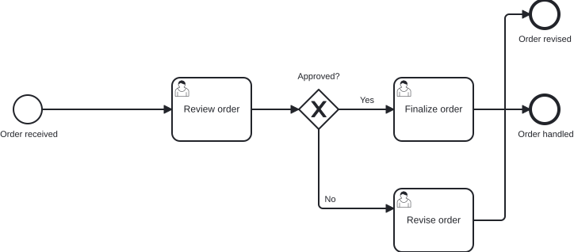
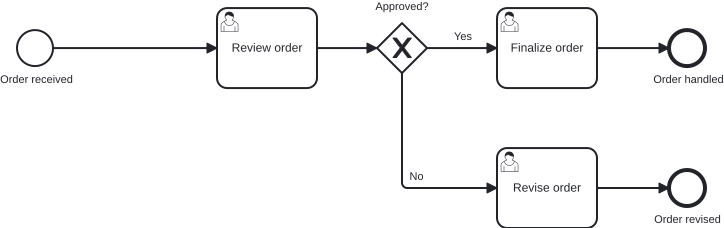

# `@miragon/rules/flow-crossing`

> This rule is a non-blocking `warn` in both `plugin:@miragon/rules/recommended-for-modeling` and `plugin:@miragon/rules/recommended-for-automation`. In `plugin:@miragon/rules/all` it is an `error`. Override it to `warn`, `error` or `off` yourself.

Reports a pair of sequence flows whose drawn paths cross each other within the same plane.

## Why

The diagram is the artifact a reviewer signs off on and that a stakeholder reads to follow the
process. Two flows that cross create a visual knot exactly where the reader is trying to trace which
path leads where, so a rejected order and a loop-back become hard to tell apart at the one point they
overlap. The crossing lives only in the DI coordinates, so it never shows in the semantic XML and no
structural rule catches it. bpmnlint's `no-overlapping-elements` compares shape-vs-shape bounds and
never inspects waypoints, so an edge crossing another edge slips through.

## Why this matters for agentic BPMN

Agents and auto-layout write waypoints directly rather than routing edges the way a modeler drags
them, so a loop-back or a branch is easily drawn straight across an unrelated flow. The semantics
stay correct, the XML diff looks clean, and the tangle shows only once the diagram is rendered for a
human to read.

**Typical AI artifact without this rule:** a flow to a separate outcome routed straight up across the
main path, crossing a forward flow it has nothing to do with, invisible in the XML and obvious only
once the diagram is drawn.

**What this rule guarantees:** no two sequence flows form an X in the rendered diagram, so every path
can be traced without untangling it from another.

## What it does not report

The rule stays conservative, so it never fires on a clean diagram:

- **Overlap**: two flows that run on top of each other (collinear) are allowed. Only a true crossing,
  where one flow strictly passes from one side of another to the other, counts.
- **Shared node**: a pair of flows that leave or enter the same element (a gateway fan-out or
  fan-in) is skipped, so branch flows splaying from a common tip never report each other.
- **Touching endpoints**: a flow whose endpoint lands on another flow's line (a T-junction) touches
  but does not cross.

Comparison is scoped per `bpmndi:BPMNPlane`, so a drill-down diagram is never measured against the
main one.

## Examples

Both models are the same order review, where `Approved?` either finalizes the order or sends it to `Revise order`, which ends in its own `Order revised` outcome.

👎 Invalid: the flow from `Revise order` to `Order revised` is routed up to a top-right end event, crossing the `Finalize order` to `Order handled` flow

👍 Valid: `Order revised` sits level with `Revise order`, so its flow runs straight and crosses nothing

## Further reading

- [Camunda: Creating readable process models](https://docs.camunda.io/docs/components/best-practices/modeling/creating-readable-process-models/): the layout guidance that crossing flows break.

## Related

- [`@miragon/rules/flow-through-element`](./flow-through-element.md): the companion geometry rule for a flow routed through a shape rather than across another flow.
