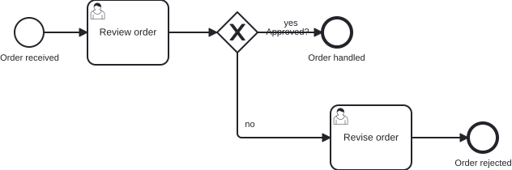

# `@miragon/rules/flow-orthogonal`

> This rule is a non-blocking `warn` in both `plugin:@miragon/rules/recommended-for-modeling` and `plugin:@miragon/rules/recommended-for-automation`. In `plugin:@miragon/rules/all` it is an `error`. Override it to `warn`, `error` or `off` yourself.

Reports a sequence flow that runs diagonally — a flow with a segment routed at a slant instead of horizontally or vertically.

## Why

A BPMN diagram is read far more often than its XML, by modelers, reviewers and business stakeholders
alike, and it reads cleanest when every flow runs on the grid: horizontal and vertical segments,
meeting at right angles. A slanted flow cuts across that grid, so the eye can no longer follow the
arrows along clean lines and has to trace each one by hand. Modelers do not draw diagonal flows, so
one in the model is a sign the diagram was laid out by a machine rather than a person.

## Why this matters for agentic BPMN

Agents and auto-layout write DI waypoints directly. They connect the right elements, but they place
the waypoints wherever the maths lands, so a branch drops from a gateway straight to a task on a
slant instead of stepping down and across. The XML review looks clean, the connection is valid, and
only the drawn diagram shows the diagonal.

**Typical AI artifact without this rule:** a gateway branch drawn as one straight diagonal line to a
task placed below and to the side, instead of a horizontal and vertical step.

**What this rule guarantees:** every sequence flow is routed with horizontal and vertical segments
only, so the diagram reads as a clean orthogonal layout.

## Scope

Only the **DI coordinates** decide, scoped per `BPMNPlane`. Every segment of a flow's waypoint
polyline must run horizontal or vertical: a segment is slanted when it moves meaningfully on both
axes at once (its shorter axis span is more than a small fraction of its longer one, so a few pixels
of drift on a long segment stays orthogonal). Any flow with a slanted segment is reported, including
a single straight diagonal between two shapes.

A direct diagonal between two misaligned shapes is also reported by
[`flow-target-alignment`](./flow-target-alignment.md), which points at the misaligned shapes behind
it. The two overlap on purpose: they suggest different fixes, align the shapes or route the flow
orthogonally, and either resolves both findings.

## Examples

An order-approval process where the "no" branch leaves the gateway for a revise task drawn below.
The two pictures share the same model; only that branch differs.

👎 Invalid: the "no" branch drops from the gateway to the revise task as one straight diagonal


👍 Valid: the "no" branch steps down and across in horizontal and vertical segments



The same, as XML. 👎 wrong:

```xml
<!-- flow_reject runs diagonally from the gateway to the task -->
<bpmndi:BPMNEdge bpmnElement="flow_reject">
  <di:waypoint x="435" y="225" />
  <di:waypoint x="550" y="330" />
</bpmndi:BPMNEdge>
```

👍 right:

```xml
<!-- the same branch, down then across -->
<bpmndi:BPMNEdge bpmnElement="flow_reject">
  <di:waypoint x="435" y="225" />
  <di:waypoint x="435" y="330" />
  <di:waypoint x="550" y="330" />
</bpmndi:BPMNEdge>
```

## Further reading

- [Camunda: Creating readable process models](https://docs.camunda.io/docs/components/best-practices/modeling/creating-readable-process-models/): the clean, orthogonal layout guidance a slanted flow breaks.

## Related

- [`@miragon/rules/flow-target-alignment`](./flow-target-alignment.md): reports the misaligned shapes behind a direct diagonal flow.
