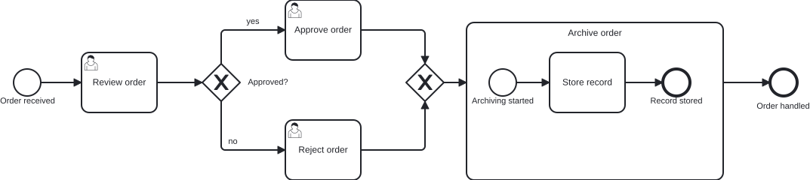
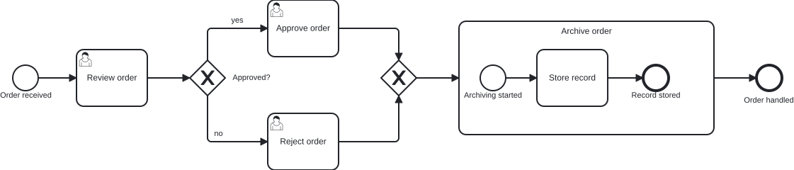

# `@miragon/rules/flow-target-alignment`

> This rule is a non-blocking `warn` in both `plugin:@miragon/rules/recommended-for-modeling` and `plugin:@miragon/rules/recommended-for-automation`; in `plugin:@miragon/rules/all` it is an `error`. Override it to `warn`/`error`/`off` yourself.

Reports an outgoing sequence flow whose **target sits at a different height than its source**, so the
main path slopes up or down instead of reading as a straight horizontal line — **except** when a
gateway (or a boundary event) is involved, since those legitimately branch up and down.

## Why

A readable BPMN model flows left to right along a straight main path: each step is drawn on the same
row as the one before it, so the eye follows one horizontal line from start to end. When a flow's
target is drawn higher or lower than its source, that line bends into a diagonal or a zig-zag — the
model still means the same thing, but it no longer _reads_ as a single main path.

This is deliberately a **separate** concern from
[`flow-connection-side`](./flow-connection-side.md): that rule checks the _side_ a flow docks onto
(out right, in left, gateway tips). A model can dock every flow on the correct side and still slope,
because the target is simply drawn off the row. This rule catches exactly that.

## Why this matters for agentic BPMN

Agents and auto-layout write DI coordinates directly. They connect the right elements and often dock
on the right side, but place each shape wherever the maths lands — one task a hundred pixels lower
than the last. The XML review looks clean and even `flow-connection-side` passes; only the drawn
diagram shows the main path staircasing down the canvas.

**Typical AI artifact without this rule:** a straight sequence of tasks and events where each one is
nudged a little lower than the previous, so the "main flow" descends diagonally across the diagram.

**What this rule guarantees:** every non-branching sequence flow keeps its target on the same row as
its source, so the main path renders as one straight horizontal line.

## Scope

Only the **DI coordinates** decide: for each sequence flow, the vertical centre of the source shape
is compared against the vertical centre of the target shape. They must match within a small tolerance
(10px) to count as the same row.

Comparison is scoped per `BPMNPlane`. Left alone:

- **Gateways**, on either end of a flow — a gateway is where a process branches, so its paths are
  _meant_ to leave and arrive above or below the row.
- **Boundary events** — they sit on their host's border and typically drop to a handler placed below.
- Flows with **no DI** for one of their ends — nothing to compare, so never guessed.

## Examples

An order-approval process — start event, a review task, a split/merge gateway pair with two branch
tasks, an archive task and an end event. The main path should run straight along one row; the gateway
branches up and down as expected.

- **Invalid** — the end event `event_Done` is drawn well below the row, so `flow_Archived` slopes
  down into it even though every other step is aligned and every dock is on the correct side.
- **Valid** — `event_Done` is back on the row, so `flow_Archived` runs straight and the whole main
  path reads as one horizontal line. The gateway branches (up to _approve_, down to _reject_) are
  never judged.

👎 Invalid — the final flow slopes down to an off-row end event



👍 Valid — every non-branching flow stays on one row, the main path straight



```xml
<!-- 👎 archive (centre y=200) → end event (centre y=280): the main path slopes down -->
<bpmndi:BPMNShape bpmnElement="event_End">
  <dc:Bounds x="950" y="262" width="36" height="36" />
</bpmndi:BPMNShape>
<bpmndi:BPMNEdge bpmnElement="flow_Archived">
  <di:waypoint x="890" y="200" />
  <di:waypoint x="920" y="200" />
  <di:waypoint x="920" y="280" />
  <di:waypoint x="950" y="280" />
</bpmndi:BPMNEdge>

<!-- 👍 end event back on the row (centre y=200): the flow runs straight -->
<bpmndi:BPMNShape bpmnElement="event_End">
  <dc:Bounds x="950" y="182" width="36" height="36" />
</bpmndi:BPMNShape>
<bpmndi:BPMNEdge bpmnElement="flow_Archived">
  <di:waypoint x="890" y="200" />
  <di:waypoint x="950" y="200" />
</bpmndi:BPMNEdge>
```

## Further reading

- [Camunda — Creating readable process models](https://docs.camunda.io/docs/components/best-practices/modeling/creating-readable-process-models/) — the left-to-right, straight-main-path layout guidance a sloping flow breaks.
