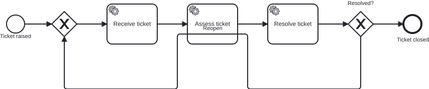
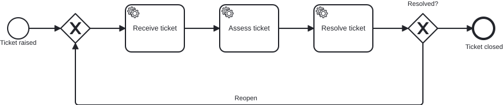

# `@miragon/rules/flow-through-element`

> This rule is a non-blocking `warn` in both `plugin:@miragon/rules/recommended-for-modeling` and `plugin:@miragon/rules/recommended-for-automation`; in `plugin:@miragon/rules/all` it is an `error`. Override it to `warn`/`error`/`off` yourself.

Reports a sequence flow whose drawn path is routed **through the body** of a shape it does not
connect to.

## Why

This is the gap bpmnlint's `no-overlapping-elements` leaves open: that rule compares
shape-vs-shape bounds and never inspects edge geometry. So an agent can re-route a flow straight
across an unrelated task without moving a single shape, and nothing in the shipped rule set
fires — every shape is still exactly where it belongs.

## Why this matters for agentic BPMN

Agents and auto-layout write DI coordinates directly instead of routing edges the way a modeler
does, so a flow is easily drawn straight across a shape it has nothing to do with. The semantics are
untouched — the XML diff looks clean — but the picture is misleading, and code that reads the
geometry can mistake the pass-through for a connection.

**Typical AI artifact without this rule:** a re-routed sequence flow whose waypoints run through the
body of an unrelated task, invisible in the XML review and only obvious once the diagram is drawn.

**What this rule guarantees:** a sequence flow only ever passes through shapes it actually connects
to, keeping the rendered model faithful to its semantics and safe to process programmatically.

## What it does not report

Shapes a flow may legitimately pass over are excluded:

- **Enclosing containers** — pools, lanes, groups, and **expanded** sub-processes. A flow drawn
  "over" a container it lives inside is not a defect. A **collapsed** sub-process is a
  task-sized box and _is_ treated as an obstacle.
- **Boundary events and their host.** A boundary event sits on its host's border, so the flow
  leaving it starts inside the host's bounds.
- **Decorative overlays** — text annotations, groups, data objects and data stores.
- The flow's own source and target.

Container membership uses moddle **inheritance**, so `bpmn:Transaction` and
`bpmn:AdHocSubProcess` count as sub-processes.

## Known limitations

Left to visual review: a flow drawn over a text _label_, and message-flow / association routing.

## Examples

👎 Invalid — the `Reopen` loop-back is drawn straight through `serviceTask_Assess`, which it does not connect to

👍 Valid — the same loop-back routed below the row, around every shape

## Further reading

- [Camunda — Creating readable process models](https://docs.camunda.io/docs/components/best-practices/modeling/creating-readable-process-models/) — the layout guidance a flow drawn through an unrelated shape breaks.
