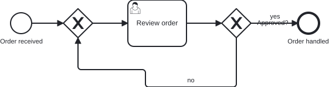
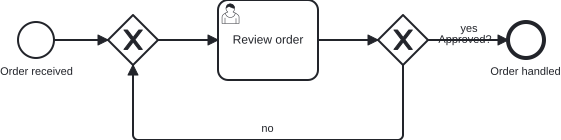

# `@miragon/rules/flow-zigzag`

> This rule is a non-blocking `warn` in both `plugin:@miragon/rules/recommended-for-modeling` and `plugin:@miragon/rules/recommended-for-automation`. In `plugin:@miragon/rules/all` it is an `error`. Override it to `warn`, `error` or `off` yourself.

Reports a sequence flow that reverses on itself and keeps bending, winding to its target instead of reaching it directly.

## Why

A BPMN diagram is read far more often than its XML, by modelers, reviewers and business stakeholders
alike, and they follow a flow fastest when it makes steady progress to its target. Every extra corner
where the flow doubles back is one the reader has to trace by hand to see where the arrow lands. The
connection is semantically fine, but the drawn model, the picture a stakeholder signs off on and a
reviewer diffs, reads as noise.

This is a separate concern from [`flow-orthogonal`](./flow-orthogonal.md), which checks that segments
run on the grid, and from [`flow-target-alignment`](./flow-target-alignment.md), which checks whether
source and target sit on the same row. A flow can be perfectly orthogonal and connect two aligned
elements and still wind its way across the canvas. This rule catches exactly that.

## Why this matters for agentic BPMN

Agents and auto-layout write DI waypoints directly. They connect the right elements, but the routing
they emit often piles up waypoints: a loop-back that wraps and then stair-steps its way home, a
detour that jogs down and back up for no reason. The XML review looks clean, the connection is valid,
and only the drawn diagram shows the snake.

**Typical AI artifact without this rule:** a rework loop that leaves its gateway, wraps back toward an
earlier step, and adds two or three redundant corners on the way instead of a clean turn.

**What this rule guarantees:** every sequence flow either makes monotone progress to its target or
wraps back in a couple of bends, so no flow renders as a winding line.

## Scope

Only the **DI coordinates** decide, scoped per `BPMNPlane`. The rule tells two shapes of route apart:

- A **monotone** flow, one that never doubles back on either axis (a straight line, an L, a Z, or a
  staircase that steps toward its target across rows or lanes), is always fine, **however many bends
  it has**. It reads as steady progress, so its bend count is not judged. This is why a flow that
  crosses several lanes with `right, down, right, down` is never reported.
- A flow that **reverses** direction has to turn back on itself. A legitimate loop-back does this to
  reach an earlier element, and a clean wrap needs only two or three bends (down, across, up). The
  rule allows that budget: a reversing flow is reported only when it makes more than
  [`maxWrapBends`](#configuration) bends, at which point the wrap has become a zigzag.

Slanted segments are [`flow-orthogonal`](./flow-orthogonal.md)'s concern, so this rule assumes
orthogonal routing and only judges directness. Left alone: a flow onto its own element (a self-loop
is always a full wrap).

## Configuration

```json
{
  "rules": {
    "@miragon/rules/flow-zigzag": [
      "error",
      {
        "maxWrapBends": 3
      }
    ]
  }
}
```

| Option         | Default | Effect                                                                        |
| -------------- | ------- | ----------------------------------------------------------------------------- |
| `maxWrapBends` | `3`     | How many bends a flow that reverses direction may make before it is reported. |

A monotone flow is never judged by `maxWrapBends`, so raising or lowering it only changes how much
winding a loop-back or a backtracking flow may do. Raise it for diagrams where a flow legitimately
has to wrap around several elements to get back to its source.

## Examples

An order-approval process with a rework loop: a review task, an "Approved?" gateway, and a "no" flow
that loops back to a merge gateway so a rejected order is reviewed again. The two pictures share the
same model; only the loop-back flow differs.

👎 Invalid: the "no" loop-back wraps and then stair-steps its way home through four bends



👍 Valid: the "no" loop-back wraps home cleanly in two bends



The same, as XML. 👎 wrong:

```xml
<!-- flow_rework wraps back but adds a stair-step: down, left, up, left, up -->
<bpmndi:BPMNEdge bpmnElement="flow_rework">
  <di:waypoint x="545" y="225" />
  <di:waypoint x="545" y="310" />
  <di:waypoint x="390" y="310" />
  <di:waypoint x="390" y="280" />
  <di:waypoint x="275" y="280" />
  <di:waypoint x="275" y="225" />
</bpmndi:BPMNEdge>
```

👍 right:

```xml
<!-- the same loop-back, a clean wrap: down, left, up -->
<bpmndi:BPMNEdge bpmnElement="flow_rework">
  <di:waypoint x="545" y="225" />
  <di:waypoint x="545" y="300" />
  <di:waypoint x="275" y="300" />
  <di:waypoint x="275" y="225" />
</bpmndi:BPMNEdge>
```

## Further reading

- [Camunda: Creating readable process models](https://docs.camunda.io/docs/components/best-practices/modeling/creating-readable-process-models/): the straight, direct routing guidance a winding flow breaks.

## Related

- [`@miragon/rules/flow-orthogonal`](./flow-orthogonal.md): the companion rule for a flow drawn on a slant rather than a winding orthogonal route.
- [`@miragon/rules/flow-target-alignment`](./flow-target-alignment.md): a companion layout rule for a flow whose endpoints sit on different rows.
